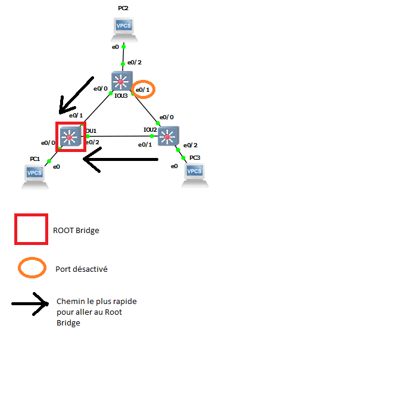
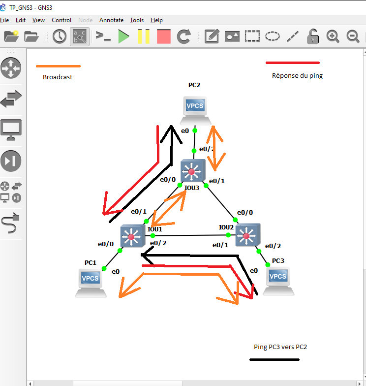

# TP2 Réseau

## Simplest setup

-   Mise en place de la topologie  
    | PC1: `10.2.1.1/24` +--------+ SW1 +--------+ PC2: `10.2.1.2/24` |

-   Faire communiquer les 2 PCs

    ```
    PC1> ping 10.2.1.2
    84 bytes from 10.2.1.2 icmp_seq=1 ttl=64 time=0.175 ms
    84 bytes from 10.2.1.2 icmp_seq=2 ttl=64 time=0.432 ms
    84 bytes from 10.2.1.2 icmp_seq=3 ttl=64 time=0.301 ms

    ```

-   Protocole utilisé par `ping`  
    `"8","3.619288","10.2.1.1","10.2.1.2","ICMP","98","Echo (ping) request id=0x1f14, seq=1/256, ttl=64 (reply in 9)"`  
    Après avoir lancé wireshark et un ping du PC vers le PC1, on remarque que le protocole utilisé est **ICMP**

-   ARP

    -   ARP Request :  
        `"5","3.618218","Private_66:68:00","Broadcast","ARP","64","Who has 10.2.1.2? Tell 10.2.1.1"`
    -   ARP Reply :  
        `"6","3.619157","Private_66:68:01","Private_66:68:00","ARP","64","10.2.1.2 is at 00:50:79:66:68:01"`

-   Récapitulatif lorsque `PC1 ping PC2` pour la première fois

    -   **Echange ARP** : `PC1` envoi une requête à destination de tout le monde en demande qui a l'IP `10.2.1.2`, et disant que son IP à lui est `10.2.1.1`. Le switch récupere cette requete et en renvoi une en faisant la même chose. Le `PC2` reçoit cette requete, et de son coté en renvoie une en disant "C'est mon IP, voici ma mac".  
        Dans la table ARP de `PC1` s'ajoutera alors une ligne avec l'IP de `PC2` et sa `mac`.
    -   **Echange `ping`** : lorsque

-   Pourquoi le switch n'a pas besoin d'IP :

-   Pourquoi besoin d'IP pour se `ping` :

## More switches

-   Mise en place de la topologie :  

                               +--------------------+
                               | PC2: `10.2.1.1/24` |
                               +----------+---------+
                                          |
                                          |
                                      +---+---+
                                  +---+  SW2  +----+
                                  |   +-------+    |
                                  |                |
                                  |                |
+--------------------+        +---+---+        +---+---+        +--------------------+
| PC1: `10.2.1.1/24` +--------+  SW1  +--------+  SW3  +--------+ PC3: `10.2.1.1/24` |
+--------------------+        +-------+        +-------+        +--------------------+

- Faire communiquer les 3 PCs :  
	- PC1 vers PC2 :  
		```
		PC1> ping 10.2.2.2
		84 bytes from 10.2.2.2 icmp_seq=1 ttl=64 time=0.453 ms
		84 bytes from 10.2.2.2 icmp_seq=2 ttl=64 time=0.461 ms
		84 bytes from 10.2.2.2 icmp_seq=3 ttl=64 time=0.402 ms

     		```
	- PC1 vers PC3 :
		```
		PC1> ping 10.2.2.3
		84 bytes from 10.2.2.3 icmp_seq=1 ttl=64 time=0.273 ms
		84 bytes from 10.2.2.3 icmp_seq=2 ttl=64 time=0.446 ms
		84 bytes from 10.2.2.3 icmp_seq=3 ttl=64 time=0.410 ms

     		```

- Analyser la table MAC d'un switch :  
	```
	IOU1# show mac address-table
        Mac Address Table
	-------------------------------------------

	Vlan    Mac Address       Type        Ports
	----    -----------       --------    -----
	   1    0050.7966.6801    DYNAMIC     Et0/1
	   1    0050.7966.6803    DYNAMIC     Et0/0
	   1    aabb.cc00.0210    DYNAMIC     Et0/2
	   1    aabb.cc00.0300    DYNAMIC     Et0/1
	   1    aabb.cc00.0310    DYNAMIC     Et0/2

	```
Ces lignes apparaissent car j'ai fais un `ping` de PC1 vers PC2 et PC3.  
En faisant `show mac address-table` sur un switch, on voit les machines qui sont connecté à ce switch. Ici 2 autres switch + les PC connectés à ces swtich. Comme ce sont des switch, on voit aussi les machines connectéees à ces 2 switch, avec chaque adresse mac, ainsi que les interfaces auquelles ils sont liés.  

### Mise en évidence du Spanning Tree Protocol

- Déterminer les information STP & `root bridge`:  
`show spanning-tree` sur chacun des swtich.  
	- Swtich 1 : 
		```
		Interface           Role Sts Cost      Prio.Nbr Type
	------------------- ---- --- --------- -------- --------------------------------
		Et0/0               Desg FWD 100       128.1    Shr
		Et0/1               Desg FWD 100       128.2    Shr
		Et0/2               Desg FWD 100       128.3    Shr
		Et0/3               Desg FWD 100       128.4    Shr
		Et1/0               Desg FWD 100       128.5    Shr
		Et1/1               Desg FWD 100       128.6    Shr
		Et1/2               Desg FWD 100       128.7    Shr
		Et1/3               Desg FWD 100       128.8    Shr
		Et2/0               Desg FWD 100       128.9    Shr
		Et2/1               Desg FWD 100       128.10   Shr
		Et2/2               Desg FWD 100       128.11   Shr
		Et2/3               Desg FWD 100       128.12   Shr
		Et3/0               Desg FWD 100       128.13   Shr
		Et3/1               Desg FWD 100       128.14   Shr
		Et3/2               Desg FWD 100       128.15   Shr
		Et3/3               Desg FWD 100       128.16   Shr
		```
		Ce swtich est le root bridge car on voit que tous les roles sont en `Desg`.

	- Swtich 2 : 
		```
		Interface           Role Sts Cost      Prio.Nbr Type
		------------------- ---- --- --------- -------- ------------------------
		Et0/0               Desg FWD 100       128.1    Shr
		Et0/1               Root FWD 100       128.2    Shr
		Et0/2               Desg FWD 100       128.3    Shr
		Et0/3               Desg FWD 100       128.4    Shr
		Et1/0               Desg FWD 100       128.5    Shr
		Et1/1               Desg FWD 100       128.6    Shr
		Et1/2               Desg FWD 100       128.7    Shr
		```
		Ce switch passe part l'interface et0/1 pour aller jusqu'au `root bridge`. C'est le chemin le plus rapide pour lui.  

	- Swtich 3 : 
		```
		Interface           Role Sts Cost      Prio.Nbr Type
		------------------- ---- --- --------- -------- ------------------------
		Et0/0               Root FWD 100       128.1    Shr
		Et0/1               Altn BLK 100       128.2    Shr
		Et0/2               Desg FWD 100       128.3    Shr
		Et0/3               Desg FWD 100       128.4    Shr
		Et1/0               Desg FWD 100       128.5    Shr
		Et1/1               Desg FWD 100       128.6    Shr
		Et1/2               Desg FWD 100       128.7    Shr
		```
		Ce switch passe part l'interface et0/0 pour aller jusqu'au `root bridge`. C'est le chemin le plus rapide pour lui.  
		On voit également que le port désactivé est et0/1 du switch 3.  

- Faire un schéma représentant les infos `STP` :  


- Le port e0/1 du switch 3 étant désactivé, lors du `ping` de PC3 vers PC2, le chemin ne sera pas "direct". C'est à dire qu'au lieu de passer par le switch 2, puis directement par le 3 afin d'arriver à PC, il devra passer par le switch 1 puis ensuite le 3.

- Schéma du ping de PC3 vers PC2



- Changer la priorité d'un switch qui n'est pas root bridge
Changement sur le switch 3, je passe la priorité a 28672 au lieu de 32768. Ainsi il passera en root bridge.
Pour cela, passer en `conf t`. Ensuite :  
	```
	IOU3(config)#spanning-tree vlan 1 priority 28672
	```
Le switch à bien changé sa priorité  
```
VLAN0001
Spanning tree enabled protocol rstp
Root ID    Priority    28673
			Address     aabb.cc00.0300
			This bridge is the root
			Hello Time   2 sec  Max Age 20 sec  Forward Delay 15 sec
```
On remarque maintenant que l'interface bloqué se trouve au niveau du switch 2 et0/1  
```

IOU2#show spanning-tree

VLAN0001
  Spanning tree enabled protocol rstp
  Root ID    Priority    28673
             Address     aabb.cc00.0300
             Cost        100
             Port        1 (Ethernet0/0)
             Hello Time   2 sec  Max Age 20 sec  Forward Delay 15 sec

  Bridge ID  Priority    32769  (priority 32768 sys-id-ext 1)
             Address     aabb.cc00.0200
             Hello Time   2 sec  Max Age 20 sec  Forward Delay 15 sec
             Aging Time  300 sec

Interface           Role Sts Cost      Prio.Nbr Type
------------------- ---- --- --------- -------- --------------------------------
Et0/0               Root FWD 100       128.1    Shr
Et0/1               Altn BLK 100       128.2    Shr
Et0/2               Desg FWD 100       128.3    Shr
Et0/3               Desg FWD 100       128.4    Shr
Et1/0               Desg FWD 100       128.5    Shr
Et1/1               Desg FWD 100       128.6    Shr
Et1/2               Desg FWD 100       128.7    Shr

```
 
## Isolation

### 1. Simple  

- Mise en place de la topologie avec les vlans

J'ai mis en place les IP sur chaque machine et ensuite configuré les VLAN.  
PC1 ne peux `ping` personne et PC2 et PC3 peuvent se `ping` entre eux.  
ping PC1 vers PC2 :  
```
PC1> ping 10.2.3.2
host (10.2.3.2) not reachable
```  
ping PC2 vers PC3 :  
```
PC2> ping 10.2.3.3
84 bytes from 10.2.3.3 icmp_seq=1 ttl=64 time=0.218 ms
84 bytes from 10.2.3.3 icmp_seq=2 ttl=64 time=0.346 ms

```  

### 2. Avec Trunk

Mise en place de la topologie :  
- `PC1 : ip 10.2.10.1 / VLAN 10`
- `PC2 : ip 10.2.20.1 / VLAN 20`
- `PC3 : ip 10.2.10.2 / VLAN 10`
- `PC4 : ip 10.2.20.2 / VLAN 20`  

Mise en place des VLAN afin de faire communiquer PC1 avec PC3 et PC2 avec PC4  
- Ping de PC2 vers PC4 :  
	```
	PC2> ping 10.2.20.2
	84 bytes from 10.2.20.2 icmp_seq=1 ttl=64 time=0.359 ms
	84 bytes from 10.2.20.2 icmp_seq=2 ttl=64 time=0.640 ms

	```  
- Ping de PC2 vers PC1 :
	```
	PC2> ping 10.2.10.1
	host (10.2.10.1) not reachable
	```

