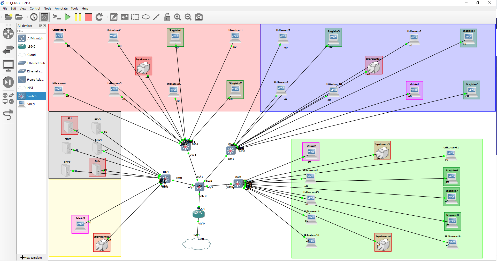

# TP3 : Routage INTER-VLAN + mise en situation
## I. Mise en place du schéma  
```
             +--+
             |R1|
             +-++
               |
               |                    +---+
               |          +---------+PC4|
+---+        +-+-+      +---+       +---+
|PC1+--------+SW1+------+SW2|
+---+        +-+-+      +-+--+
               |          |  |
               |          |  +------+--+
               |          |         |P1|
             +-+-+      +-+-+       +--+
             |PC2|      |PC3|
             +---+      +---+
```


**Tableau des réseaux utilisés**

Réseau | Adresse | VLAN | Description
--- | --- | --- | ---
`net1` | `10.3.10.0/24` | 10 | Utilisateurs
`net2` | `10.3.20.0/24` | 20 | Admins
`net3` | `10.3.30.0/24` | 30 | Visiteurs
`netP` | `10.3.40.0/24` | 40 | Imprimantes

**Tableau d'adressage**

Machine | VLAN | IP `net1` | IP `net2` | IP `net3` |  IP `netP`
--- | --- | --- | --- | --- | ---
PC1 | 10 | `10.3.10.1/24` | x | x | x
PC2 | 20 | x | `10.3.20.2/24` | x | x | x
PC3 | 20 | x | `10.3.20.3/24` | x | x | x
PC4 | 30 | x | x |  `10.3.30.4/24` | x | x
P1 | 40 | x | x | x | `10.3.40.1/24` 
R1 | x |  `10.3.10.254/24` | `10.3.20.254/24` | `10.3.30.254/24` | `10.3.40.254/24` 

**Qui peut joindre qui ?**

✅ = peuvent se joindre
❌ = ne peuvent pas se joindre

Réseaux | `net1` |  `net2` |  `net3` |  `netP`
--- | --- | --- | --- | ---
 `net1` | ✅ | ❌ | ❌ | ❌
 `net2` | ❌ | ✅ | ✅ | ✅
 `net3` | ❌ | ✅ | ✅ | ✅
 `netP` | ❌ | ✅ | ✅ | ✅

Après avoir setup this shit je peux faire mes `ping` :  
- `PC1` vers `PC2` (et tous le monde) :  
    ```
    PC1> ping 10.3.20.2
    host (10.3.10.254) not reachable
    ```  
    Le vlan 10 n'est pas autorisé entre le switch1 et le routeur donc le ping ne passe pas.  
- `PC2` vers `PC4` :  
    ```
    PC2> ping 10.3.30.4
    10.3.30.4 icmp_seq=1 timeout
    10.3.30.4 icmp_seq=2 timeout
    84 bytes from 10.3.30.4 icmp_seq=3 ttl=63 time=14.926 ms
    84 bytes from 10.3.30.4 icmp_seq=4 ttl=63 time=17.600 ms
    ```  
    `10.3.30.4 icmp_seq=1 timeout` : cette ligne apparaît car la requête ARP lors du premier `ping` se fait en meme temps que le `ping`, donc la première trame est "perdue".  

- `PC2` vers `P` :  
    ```
    PC2> ping 10.3.40.1
    10.3.40.1 icmp_seq=1 timeout
    10.3.40.1 icmp_seq=2 timeout
    84 bytes from 10.3.40.1 icmp_seq=3 ttl=63 time=18.934 ms
    84 bytes from 10.3.40.1 icmp_seq=4 ttl=63 time=12.477 ms
    ```

- `PC2` vers `PC3` :  
    ```
    PC2> ping 10.3.20.3
    84 bytes from 10.3.20.3 icmp_seq=1 ttl=64 time=0.287 ms
    84 bytes from 10.3.20.3 icmp_seq=2 ttl=64 time=0.505 ms
    84 bytes from 10.3.20.3 icmp_seq=3 ttl=64 time=0.479 ms
    ```

- `PC3` vers `PC4` :  
    ```
    PC3> ping 10.3.30.4
    84 bytes from 10.3.30.4 icmp_seq=1 ttl=63 time=14.584 ms
    84 bytes from 10.3.30.4 icmp_seq=2 ttl=63 time=15.772 ms
    84 bytes from 10.3.30.4 icmp_seq=3 ttl=63 time=12.007 ms
    ```  

- `PC3` vers `P` :  
    ```
    PC3> ping 10.3.40.1
    84 bytes from 10.3.40.1 icmp_seq=1 ttl=63 time=18.813 ms
    84 bytes from 10.3.40.1 icmp_seq=2 ttl=63 time=13.658 ms
    84 bytes from 10.3.40.1 icmp_seq=3 ttl=63 time=20.472 ms
    ```  

- `PC4` vers `P` :
    ```
    PC4> ping 10.3.40.1
    10.3.40.1 icmp_seq=1 timeout
    10.3.40.1 icmp_seq=2 timeout
    84 bytes from 10.3.40.1 icmp_seq=3 ttl=63 time=14.980 ms
    84 bytes from 10.3.40.1 icmp_seq=4 ttl=63 time=14.565 ms
    ```  
Tout le monde ping tout le monde (sauf `PC1` qui lui est isolé) en utilisant comme gateway le routeur `R1`.  

## II. Cas concret

Réseau | Adresse | VLAN | Description
--- | --- | --- | ---
`net1` | `10.3.10.0/24` | 10 | Stagiaires
`net2` | `10.3.20.0/24` | 20 | Users
`net3` | `10.3.30.0/24` | 30 | Admins
`net4` | `10.3.40.0/24` | 40 | Serveurs
`net5` | `10.3.50.0/24` | 50 | Serveurs Sensibles
`net6` | `10.3.60.0/24` | 60 | Imprimantes


**Tableau d'adressage**

Machine | VLAN | IP `net1` | IP `net2` | IP `net3` |  IP `net4`| IP `net5` |  IP `net6`
--- | --- | --- | --- | --- | --- | --- | ---
Stagiaire1 | 10 | `10.3.10.1/24` | x | x | x | x | x
Stagiaire2 | 10 | `10.3.10.2/24` | x | x | x | x | x
Stagiaire3 | 10 | `10.3.10.3/24` | x | x | x | x | x
Stagiaire4 | 10 | `10.3.10.4/24` | x | x | x | x | x
Stagiaire5 | 10 | `10.3.10.5/24` | x | x | x | x | x
Stagiaire6 | 10 | `10.3.10.6/24` | x | x | x | x | x
Stagiaire7 | 10 | `10.3.10.7/24` | x | x | x | x | x
Stagiaire8 | 10 | `10.3.10.8/24` | x | x | x | x | x
User1 | 20 | x | `10.3.20.1/24` | x | x | x | x 
User2 | 20 | x | `10.3.20.2/24` | x | x | x | x 
User3 | 20 | x | `10.3.20.3/24` | x | x | x | x
User4 | 20 | x | `10.3.20.4/24` | x | x | x | x
User5 | 20 | x | `10.3.20.5/24` | x | x | x | x
User6 | 20 | x | `10.3.20.6/24` | x | x | x | x
User7 | 20 | x | `10.3.20.7/24` | x | x | x | x
User8 | 20 | x | `10.3.20.8/24` | x | x | x | x
User9 | 20 | x | `10.3.20.9/24` | x | x | x | x
User10 | 20 | x | `10.3.20.10/24` | x | x | x | x
User11 | 20 | x | `10.3.20.11/24` | x | x | x | x
User12 | 20 | x | `10.3.20.12/24` | x | x | x | x
User13 | 20 | x | `10.3.20.13/24` | x | x | x | x
User14 | 20 | x | `10.3.20.14/24` | x | x | x | x
User15 | 20 | x | `10.3.20.15/24` | x | x | x | x
User16 | 20 | x | `10.3.20.16/24` | x | x | x | x
Admin1 | 30 | x | x | `10.3.30.1/24` | x | x | x
Admin2 | 30 | x | x | `10.3.30.2/24` | x | x | x
Admin3 | 30 | x | x | `10.3.30.3/24` | x | x | x
Serveur1 | 40 | x | x | x | `10.3.40.1/24` | x | x
Serveur2 | 40 | x | x | x | `10.3.40.2/24` | x | x
Serveur3 | 40 | x | x | x | `10.3.40.3/24` | x | x
Serveur4 | 40 | x | x | x | `10.3.40.4/24` | x | x
SS1 | 50 | x | x | x | x | `10.3.50.1/24` | x
SS2 | 50 | x | x | x | x | `10.3.50.2/24` | x
Imprimante1 | 60 | x | x | x | x | x | `10.3.60.1/24`
Imprimante2 | 60 | x | x | x | x | x | `10.3.60.2/24`
Imprimante3 | 60 | x | x | x | x | x | `10.3.60.3/24`
Imprimante4 | 60 | x | x | x | x | x | `10.3.60.4/24`
Imprimante5 | 60 | x | x | x | x | x | `10.3.60.5/24`
Routeur1 | x | `10.3.10.254/24` | `10.3.20.254/24` | `10.3.30.254/24` | `10.3.40.254/24` | `10.3.50.254/24` | `10.3.60.254/24`

✅ = peuvent se joindre
❌ = ne peuvent pas se joindre

X | Admins | Users | Stagiaires | Serveurs | SS | Imprimantes
--- | --- | --- | --- | --- | --- | --- | 
Admins | ✅ | ❌ | ❌ | ✅ | ✅ | ✅ |
Users | ❌ | ✅ | ❌ | ✅ | ❌ | ✅ |
Stagiaires | ❌ | ❌ | ✅ | ❌ | ❌ | ✅ |
Serveurs | ✅ | ✅ | ❌ | ✅ | ❌ | ✅ |
Serveurs sensibles | ✅ | ❌ | ❌ | ❌ | ✅ | ❌ |
Imprimantes | ✅ | ✅ | ✅ | ✅ | ❌ | ✅ |

**Sur GNS3**  

(ouais c'est stylé)  
Pour le moment je fais en sorte que tous le monde puisse `ping` tous le monde et aient accès à l'outil internet.
- Config des `Switches` :  
    Sur chaque `Switch` je vais faire mes conf `vlan`  
    - Créer le `vlan` :  
        ```
        IOU1#conf t
        IOU1(config)#vlan 10
        IOU1(config-vlan)#name stagiaires
        IOU1(config-vlan)#exit
        IOU1(config)#vlan 20
        IOU1(config-vlan)#name users
        IOU1(config-vlan)#exit
        IOU1(config)#vlan 30
        IOU1(config-vlan)#name admins
        IOU1(config-vlan)#exit
        IOU1(config)#vlan 40
        IOU1(config-vlan)#name serveurs
        IOU1(config-vlan)#exit
        IOU1(config)#vlan 50
        IOU1(config-vlan)#name ss
        IOU1(config-vlan)#exit
        IOU1(config)#vlan 60
        IOU1(config-vlan)#name imprimantes
        IOU1(config-vlan)#exit
        IOU1(config)#exit
        ```


    - Configurer une interface entre deux `switches` en mode *trunk* 
        ```
        IOU1#conf t
        IOU1(config)#interface Ethernet 2/1
        IOU1(config-if)#switchport trunk encapsulation dot1q
        IOU1(config-if)#switchport mode trunk
        IOU1(config-if)#switchport trunk allowed vlan 10,20,30,40,50,60
        IOU1(config-if)#exit
        IOU1(config)#exit
        ```


    - Assigner une interface pour donner accès à un `vlan` en mode *access*  
        ```
        IOU1#conf t
        IOU1(config)#interface ethernet 0/1
        IOU1(config-if)#switchport mode access
        IOU1(config-if)#switchport access vlan 20
        IOU1(config-if)#exit
        IOU1(config)#exit
        ```  
- Config du `routeur` :
    - Créer les sous-interfaces (`IPs` dans mon tableau d'adressage)  
        ```
        R1#conf t
        R1(config)#interface ethernet 0/1.10
        R1(config-subif)#encapsulation dot1q 10
        R1(config-subif)#ip address 10.3.10.254 255.255.255.0
        R1(config-subif)#exit
        R1(config)#interface ethernet 0/1.20
        R1(config-subif)#encapsulation dot1q 20
        R1(config-subif)#ip address 10.3.20.254 255.255.255.0
        R1(config-subif)#exit
        R1(config)#interface ethernet 0/1.30
        R1(config-subif)#encapsulation dot1q 30
        R1(config-subif)#ip address 10.3.30.254 255.255.255.0
        R1(config-subif)#exit
        R1(config)#interface ethernet 0/1.40
        R1(config-subif)#encapsulation dot1q 40
        R1(config-subif)#ip address 10.3.40.254 255.255.255.0
        R1(config-subif)#exit
        R1(config)#interface ethernet 0/1.50
        R1(config-subif)#encapsulation dot1q 50
        R1(config-subif)#ip address 10.3.50.254 255.255.255.0
        R1(config-subif)#exit
        R1(config)#interface ethernet 0/1.60
        R1(config-subif)#encapsulation dot1q 60
        R1(config-subif)#ip address 10.3.60.254 255.255.255.0
        R1(config-subif)#exit
        R1(config)#interface ethernet 0/1
        R1(config-if)#no shut
        R1(config-if)#exit
        R1(config)#exit
        ```  

- Config côté des PCs, Imprimantes, Serveurs :
    - Donner une `IP` et définir sa `gateway` (le routeur)  
        ```
        VPCS> ip 10.3.20.1/24 10.3.20.254
        Checking for duplicate address...
        PC1 : 10.3.20.1 255.255.255.0 gateway 10.3.20.254
        ```
    - Vérifier que le PC `ping` bien le `routeur`  
        ```
        VPCS> ping 10.3.20.254
        84 bytes from 10.3.20.254 icmp_seq=1 ttl=255 time=12.180 ms
        84 bytes from 10.3.20.254 icmp_seq=2 ttl=255 time=2.889 ms
        ```
- Config du NAT pour l'accès internet
    - Récupérer une `IP` automatiquement en `dhcp`
        ```
        R1# conf t
        R1(config)# interface Ethernet 0/0
        R1(config-if)# ip address dhcp
        R1(config-if)# no shut
        ```
    - Configuration du `NAT`
        ```
        R1# conf t
        R1(config)# interface Ethernet 0/1
        R1(config-if)# ip nat outside
        R1(config-if)# exit

        R1(config)# interface Ethernet 1/0
        R1(config-if)# ip nat inside
        R1(config-if)# exit
        ```
        Puis :  
        ```
        R1# conf t
        R1(config)# ip nat inside source list 1 interface Ethernet 0/0 overload
        R1(config)# access-list 1 permit any
        ```
        Et enfin, partager la route par défaut à tout le monde :  
        ```
        R1# conf t
        R1(config)# router ospf 1
        R1(config-router)# default-information originate
        ```
    - Ping `google` pour vérifier :  
        ```
        R1#ping 8.8.8.8

        Type escape sequence to abort.
        Sending 5, 100-byte ICMP Echos to 8.8.8.8, timeout is 2 seconds:
        !!!!!
        Success rate is 100 percent (5/5), round-trip min/avg/max = 80/92/96 ms
        ```